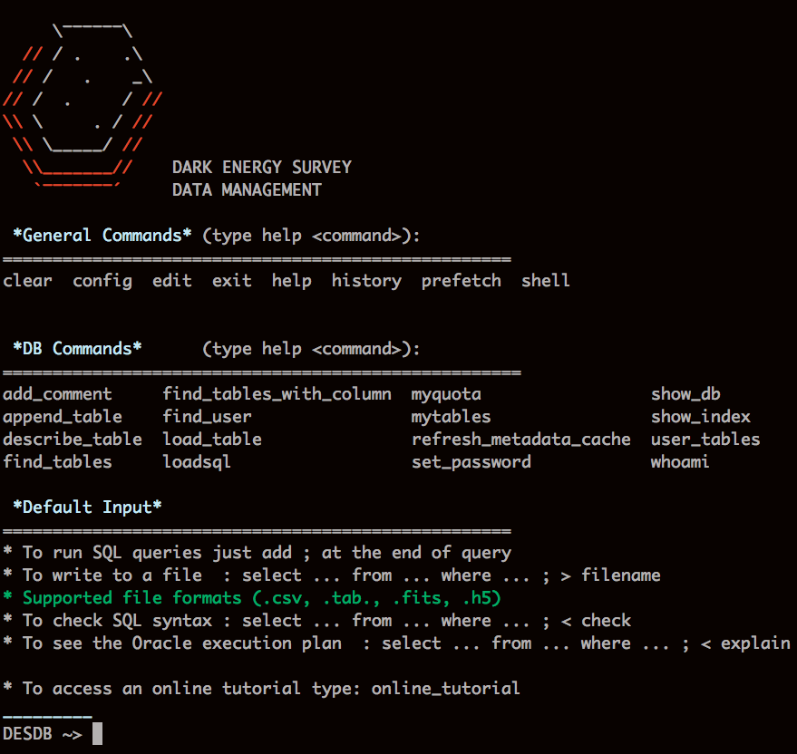

# easyaccess  

Refactored version of trivialAccess for accessing the DES DB

Python Command Line Interpreter to access Oracle DES DB
using cx_Oracle 

For a short tutorial (To be completed) chek [here](http://deslogin.cosmology.illinois.edu/~mcarras2/data/DESDM.html)
(Using des credentials)

**Current version = 1.1.0**

## Requirements

- Oracle Client > 11g.2 (External library, no python)
  Check [here](https://opensource.ncsa.illinois.edu/confluence/display/DESDM/Instructions+for+installing+Oracle+client+and+easyaccess+without+EUPS) for instructions on how to install these libraries
- [cx_Oracle](https://bitbucket.org/anthony_tuininga/cx_oracle)
- [fitsio](https://github.com/esheldon/fitsio) >= 0.9.6
- [pandas](http://pandas.pydata.org/) >= 0.14
- [termcolor](https://pypi.python.org/pypi/termcolor)
- [PyTables](http://pytables.github.io/) (optional, for hdf5 output)

## Some *nice* features
- Smart tab completion for commands, table names, column names and file paths accordingly
- write output results to csv, tab, fits files or HDF5 files
- load tables from csv or fits directly into DB
- intrinsic db commands to describe tables, own schema, quota and more
- It can be imported as module
- Can run command directly from command line
- Load sql query from file and/or from editor
- Many more

## Basic use

### Running SQL commands
Once inside the interpreter run SQL queries by adding a ; at the end::

        DESDB ~> select ... from ... where ... ;

To save the results into a table add ">" after the end of the query (after ";") and namefile at the end of line

        DESDB ~> select ... from ... where ... ; > test.fits

The files supported so far are (.csv, .tab, .fits, .h5) any other extension is ignored

### Load tables
To load a table it needs to be in a csv format with columns names in the first row
the name of the table is taken from filename

        DESDB ~> load_table <filename>

### Load SQL queries
To load sql queries just run:

        DESDB ~> loadsql <filename.sql>
or

        DESDB ~> @filename.sql

The format is the same as in command line, SQL statement must end with ;
and to write output files it must be followed by > <output file>

### TODO
    - There is a bug with some versions of readline
    - Other small changes when loading tables
    - Self-upgrade
