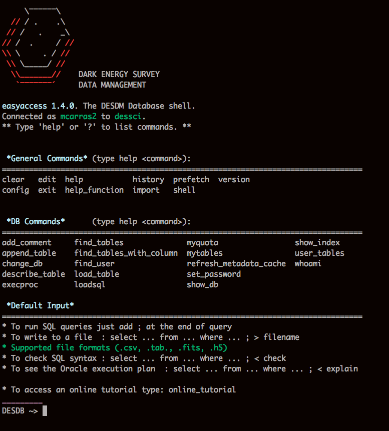

# easyaccess <a href="https://github.com/mgckind/easyaccess/releases/tag/1.4.0"> </a> <a href="https://github.com/mgckind/easyaccess/blob/master/LICENSE.txt"> </a> <a href="https://pypi.python.org/pypi/easyaccess/1.3.1"></a>


Enhanced command line SQL interpreter client for astronomical databases.

Python Command Line Interpreter to access Oracle DES DB
using cx_Oracle

For a short tutorial (To be completed) check [here](http://deslogin.cosmology.illinois.edu/~mcarras2/data/DESDM.html)
(Using des credentials)


**Current version = 1.4.0-rc1**

## Requirements

- Oracle Client > 11g.2 (External library, no python)
  Check [here](https://opensource.ncsa.illinois.edu/confluence/display/DESDM/Instructions+for+installing+Oracle+client+and+easyaccess+without+EUPS) for instructions on how to install these libraries
- [cx_Oracle](https://bitbucket.org/anthony_tuininga/cx_oracle)
  Note that cx_Oracle needs libaio on some Linux systems (e.g., #98)
- [fitsio](https://github.com/esheldon/fitsio) >= 0.9.6
- [pandas](http://pandas.pydata.org/) >= 0.14
- [termcolor](https://pypi.python.org/pypi/termcolor)
- [PyTables](http://pytables.github.io/) (optional, for hdf5 output)
- [future](http://python-future.org/) (for python 2/3 compatibility)
- [requests](http://docs.python-requests.org/en/master/)
- [gnureadline](https://github.com/ludwigschwardt/python-gnureadline) (optional, for better console behavior in OS X)
- importlib (This is only needed if running python 2.6)
- **Note that you need to install python-future for python2/3 compatibility**


## Some *nice* features
- Nice output format (using pandas)
- Very flexible configuration
- Smart tab completion for commands, table names, column names and file paths accordingly
- write output results to csv, tab, fits files or HDF5 files
- load tables from csv, fits or hdf5 directly into DB (memory friendly by using number of rows or memory limit)
- intrinsic db commands to describe tables, own schema, quota and more
- It can be imported as module from python, extense python API
- Can run command directly from command line
- Load sql query from file and/or from editor
- Show the execution plan of a query if required
- Can  run python functions inline query
- Many more

## Conda installation
Now easyaccess can be installed using [conda](http://conda.pydata.org/docs/install/quick.html) out of the box!

    conda install easyaccess -c mgckind

## Interactive interpreter

Assuming that ```easyaccess``` is in your path, you can enter the interactive interpreter by calling ```easyaccess``` without any command line arguments:

        easyaccess

### Running SQL commands
Once inside the interpreter run SQL queries by adding a ";" at the end::

        DESDB ~> select ... from ... where ... ;

To save the results into a table add ">" after the end of the query (after ";") and namefile at the end of line

        DESDB ~> select ... from ... where ... ; > test.fits

The file types supported so far are: .csv, .tab, .fits, and .h5. Any other extension is ignored.

### Load tables
To load a table it needs to be in a csv format with columns names in the first row
the name of the table is taken from filename or with optional argument --tablename

        DESDB ~> load_table <filename> --tablename <mytable> --chunksize <number of rows to read/upload> --memsize <memory in MB to read at a time>

The --chunsize and --memsize are optional arguments to facilitate uploading big files.

### Load SQL queries
To load SQL queries just run:

        DESDB ~> loadsql <filename.sql>
or

        DESDB ~> @filename.sql

The query format is the same as the interpreter, SQL statement must end with ";" and to write output files the query must be followed by " > <output file>"

### Configuration

The configuration file is located at ```$HOME/.easyaccess/config.ini``` but everything can be configured from inside easyaccess type:

        DESDB ~> help config

to see the meanings of all the options, and:

        DESDB ~> config all show

to see the current values, to modify one value, e.g., the prefetch value

        DESDB ~> config prefetch set 50000

and to see any particular option (e.g., timeout):

        DESDB ~> config timeout show

## Command-line usage

Much of the functionality provided through the interpreter is also available directly from the command line. To see a list of command-line options, use the ```--help``` option

        easyaccess --help
