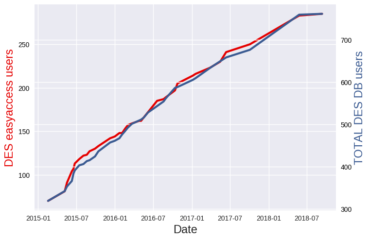
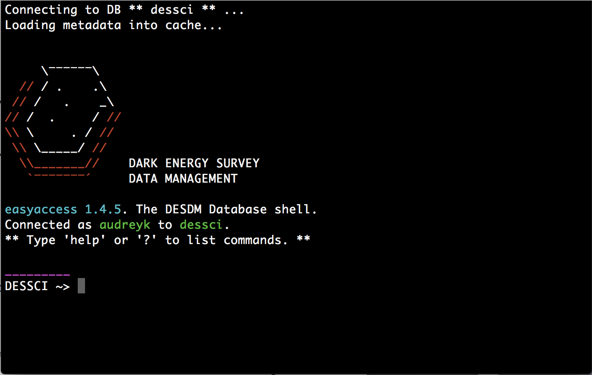

# Summary

`easyaccess` is an enhanced command line interpreter and Python package created to facilitate access to astronomical catalogs stored in SQL Databases. It provides a custom interface with custom commands and was specifically designed to access data from the [Dark Energy Survey](https://www.darkenergysurvey.org/) Oracle database, although it can easily be extended to another survey or SQL database. The package was completely written in [Python](https://www.python.org/) and support customized addition of commands and functionalities.
Visit [https://github.com/mgckind/easyaccess](https://github.com/mgckind/easyaccess) to view installation instructions, tutorials, and the Python source code for `easyaccess`.

# The Dark Energy Survey

The Dark Energy Survey (DES) [@DES2005; @DES2016] is an international, collaborative effort of over 500 scientists from 26 institutions in seven countries. The primary goals of DES are reveal the nature of the mysterious dark energy and dark matter by mapping hundreds of millions of galaxies, detecting thousands of supernovae, and finding patterns in the large-scale structure of the Universe. Survey operations began on on August 31, 2013 and will conclude in early 2019. For about 500 nights, DES has been taking thousands of deep images of southern sky, which are transferred and processed at the National Center for Supercomputing Applications ([NCSA](http://www.ncsa.illinois.edu/)). The images are processed to produce catalogs of astronomical sources with hundreds of millions of entries (billions in the case of individual detections), describing the sources found within the images and other relevant metadata.
A significant subset of the DES data was recently [made  public](https://des.ncsa.illinois.edu/releases/dr1) [@DR1] and can be accessed through several mechanisms including `easyaccess` and [web interfaces](https://des.ncsa.illinois.edu/easyweb/) that run `easyaccess` as a backend. This public release includes information for almost 400 million astrophysical sources and complementary tables to allow scientific analysis.

## DES users

The first release of `easyaccess` was on February 17th, 2015 and since then, over 300 DES Collaborators have used it to access the DES databases (Figure 1). We note that roughly 800 DES accounts exist, but this includes all database users including those that created accounts before the release of `easyaccess`. In August 2018 (version 1.4.4), we added support for the public DES data release, and since then we have increased the number of public users.

# `easyaccess`

`easyaccess` is a command line interpreter that is heavily based on `termcolor` [@termcolor] and the [`cmd`](https://docs.python.org/3/library/cmd.html) Python core module. It interfaces with `cx_Oracle` [@cxoracle] to communicate with Oracle, `requests` [@requests] for external URL requests, and other external open source libraries, including NumPy [@NumPy], `pandas` [@pandas], `fitsio` [@fitsio] and `h5py` [@h5py] to handle and transform array data. 
Figure 2 shows an example of the welcome screen as seen by a DES user.

## Features

 `easyaccess` has a variety of features including a history of past commands and smart tab auto-completion for commands, functions, columns, users, tables, and paths. Tables can be written directly into comma-separated-value (CSV) or white-space separated text files, FITS [@FITS] files, and HDF5 [@hdf5] files. It provides an iteration scheme to avoid memory constraints when retrieving large tables. Tables can also be displayed on the command line and most of the formatting is done using `pandas`. Similarly, privileged users can easily upload tables to the database from any of the file format described above in order to share data with other users. The uploading mechanism is done chunk-wise, allowing large tables to be loaded while keeping memory usage low.

 In addition, there are a variety of customized functions to search and describe the tables, search for users and user tables, check quota usage, check the Oracle execution plan, and soon the ability to run asynchronous jobs through a dedicated server. There are dozens of other minor features that allow for a seamless experience while exploring and discovering data within the hundreds of tables inside the DB.

One can also load SQL queries from a file into the database, or run SQL queries inside the `easyaccess` python module in another IDE. Most of the features are also exposed through a Python API and can be run inside a Jupyter [@jupyter] notebook or similar tool alongside scientific analyses.

Users can also use `easyaccess` to submit and request cutouts around specific positions or objects which are generated from the images. This allows better integration with other data services for a richer scientific workflow.

## Architecture

We have included a simplified UML diagram describing the architecture and dependencies of `easyaccess` (Figure 3). Figure 3 shows only the different methods for a given class and the name of the file hosting a given class. The main class, `easy_or()`, inherits all methods from all different subclasses, making this model flexible and extendable to other surveys or databases. These methods are then converted to command line commands and functions that can be called inside `easyaccess`. Given that there are some DES specific functions, we have moved DES methods into a separate class `DesActions()`.

## Installation

To download easyaccess you can clone the source code from GitHub at [https://github.com/mgckind/easyaccess](https://github.com/mgckind/easyaccess) or follow any of the standard installation channels described below.

- From [source](https://github.com/mgckind/easyaccess)

    `python setup.py install`

- [conda](https://conda.io/docs/)

    `conda install easyaccess -c mgckind`

- [Docker](https://hub.docker.com/r/mgckind/easyaccess/)

    `docker pull mgckind/easyaccess`

- [pip](https://pypi.org/project/easyaccess/1.4.4/)

    `pip install easyaccess`

# Acknowledgments

The DES Data Management System is supported by the National Science Foundation under Grant NSF AST 07-15036 and NSF AST 08-13543. 

# References
